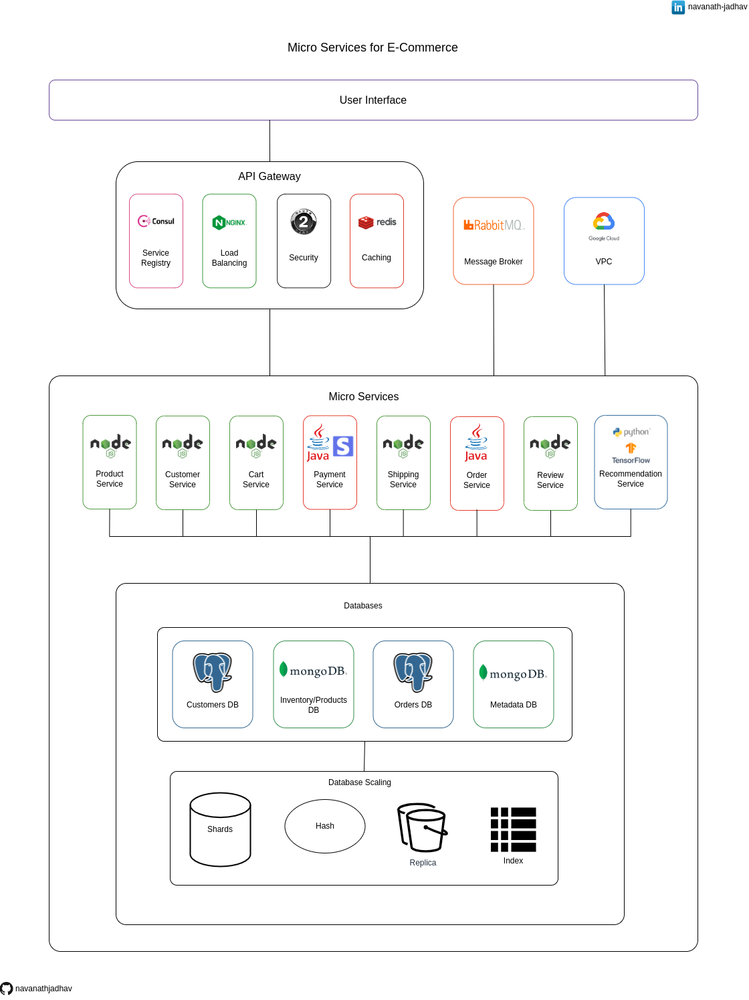

# Micro Services for E Commerce

This repository contains the architecture diagram for a Micro Services based E-commerce application. It is a modular and scalable architectural approach where various independent services handle specific functionalities, such as product catalog, user authentication, payment processing, and order management.

## Give a Star ⭐

If you liked this project or found it helpful then please give it a star.
Thanks.

## Architecture diagram

## Download

Get a [PDF version](./Micro_Services_for_E_Commerce.pdf).

## User Interface

The User Interface (UI) layer is responsible for presenting the application's visual components to users and handling their interactions. It ensures a smooth and intuitive experience by providing an appealing and responsive interface.

## API Gateway

The API Gateway serves as a centralized entry point for client requests. It acts as a mediator between the client and the Micro Services, handling tasks such as request routing, security, protocol translation, and caching. The API Gateway simplifies client-side integration by providing a unified API interface and enhancing the overall performance, scalability, and security of the system.

### Service Registry using Consul

Consul is a service registry tool that enables automatic discovery and registration of microservices in a distributed system. It provides a centralized location for microservices to register their availability and health status. Consul allows other services to dynamically discover and communicate with these registered services, facilitating seamless service-to-service communication.

### Load Balancing using Nginx

Nginx is a powerful and widely-used web server, reverse proxy, and load balancer that efficiently distributes incoming traffic across multiple backend servers. As a load balancer, Nginx intelligently routes requests to different backend servers based on predefined algorithms (e.g., round-robin, least connections).

### Security using OAuth 2.0

OAuth 2.0 is an industry-standard authorization framework that enhances security in modern applications. It allows users to grant limited access to their protected resources to third-party applications without sharing their credentials. By using access tokens, OAuth 2.0 ensures that only authorized applications can access user data. This delegation of access helps prevent the exposure of sensitive information and enables seamless and secure authentication and authorization workflows in a variety of web and mobile applications.

### Caching using Redis

Redis is an in-memory data store that excels at caching, enhancing application performance by storing frequently accessed data in memory. With low-latency access times, Redis can quickly serve cached content, reducing the need to retrieve data from slower databases. Its versatility supports various data structures, making it suitable for caching not only simple key-value pairs but also more complex data like lists, sets, and sorted sets.

## Message Broker using RabbitMQ

RabbitMQ is a robust and reliable message broker that facilitates seamless communication and coordination between microservices and distributed systems. Acting as an intermediary, RabbitMQ efficiently manages the exchange of messages between producers and consumers, enabling asynchronous communication and decoupling components.

## VPC (Virtual Private Cloud) using GCP

In Google Cloud Platform (GCP), a Virtual Private Cloud (VPC) is a private network that you can create to isolate and control the networking environment for your resources. With VPC, you can define custom IP address ranges, subnets, and network policies, giving you full control over your network topology. VPCs in GCP provide a secure and scalable foundation for deploying and managing various resources, such as virtual machine instances, Kubernetes clusters, and cloud functions.

## Micro Services

### Product Service using Node

The product service built using Node.js is a microservice responsible for handling product-related functionalities in an E-commerce application. Leveraging the asynchronous nature of Node.js, it efficiently manages tasks like product creation, retrieval, and updates. With a non-blocking event-driven architecture, the service can handle concurrent user requests, ensuring high performance and responsiveness.

### Customer Service using Node

The customer service developed with Node.js is a microservice responsible for managing customer-related functionalities in an E-commerce application. Utilizing Node.js's asynchronous capabilities, it efficiently handles tasks like customer registration, authentication, and profile updates.

### Cart Service using Node

The cart service built with Node.js is a microservice responsible for managing shopping cart functionality in an E-commerce application. Leveraging Node.js's asynchronous nature, it efficiently handles tasks like adding, updating, and removing items from the cart.

### Payment Service using Java + Stripe

The Payment service, developed using Java and integrated with Stripe, is a microservice responsible for securely processing payment transactions in an E-commerce application. Leveraging Java's robustness and Stripe's secure payment processing capabilities, it handles tasks like capturing payments, handling refunds, and managing payment methods.

### Shipping Service using Node

The shipping service built with Node.js is a microservice responsible for managing shipping and logistics in an E-commerce application. Utilizing Node.js's asynchronous capabilities, it efficiently handles tasks like order fulfillment, shipment tracking, and delivery status updates. The service communicates with external shipping providers through APIs to streamline the shipping process.

### Order Service using Java

The order service, developed using Java, is a microservice responsible for managing the entire order process in an E-commerce application. Leveraging Java's robustness, it efficiently handles tasks such as order creation, processing, and status updates. The service communicates with other microservices to ensure seamless integration with inventory, payment, and shipping services.

### Review Service using Node

The review service built with Node.js is a microservice responsible for handling product reviews and ratings in an E-commerce application. Leveraging Node.js's asynchronous capabilities, it efficiently manages tasks like creating, retrieving, and updating reviews. The service allows users to submit and view product reviews in real-time, enhancing the overall shopping experience.

### Recommendation Service using Python + TensorFlow

The recommendation service, developed using Python and TensorFlow, is a microservice responsible for providing personalized product recommendations in an E-commerce application. Leveraging TensorFlow's machine learning capabilities, it analyzes user behavior and historical data to generate relevant and personalized recommendations. The service uses Python's flexibility to seamlessly integrate with other microservices and deliver real-time recommendations, enhancing the user experience and increasing sales in the E-commerce platform.

### Databases

#### Customers DB using PostgreSQL

The Customers database, powered by PostgreSQL, is a relational database that stores and manages customer information in an E-commerce application. PostgreSQL's robustness and support for complex queries allow efficient storage and retrieval of customer data. With its transactional capabilities, it ensures data integrity and consistency. The Customers database, backed by PostgreSQL, plays a crucial role in providing a seamless and personalized experience for users in the E-commerce platform.

#### Inventory/Products DB using MongoDB

The Inventory/Products database, utilizing MongoDB, is a NoSQL database that stores and manages product information in an E-commerce application. MongoDB's flexibility and schema-less design allow easy storage of diverse product attributes. With its horizontal scaling capabilities, it accommodates a large volume of product data. The Inventory/Products database, backed by MongoDB, ensures efficient handling of product-related operations, contributing to a dynamic and scalable E-commerce platform.

#### Orders DB using PostgreSQL

The Orders database, powered by PostgreSQL, is a relational database that stores and manages order information in an E-commerce application. PostgreSQL's robustness and support for ACID transactions ensure data integrity and consistency for critical order operations. With its ability to handle complex queries, the Orders database efficiently stores and retrieves order data. The reliability and scalability of PostgreSQL make the Orders database an essential component in providing a smooth and reliable order management system in the E-commerce platform.

#### Metadata DB using MongoDB

The Metadata database, built on MongoDB, is a NoSQL database that stores and manages flexible and semi-structured metadata in an E-commerce application. MongoDB's document-based model allows easy storage and retrieval of varying metadata attributes. With its dynamic schema, the Metadata database adapts to changing metadata requirements without impacting existing data. Leveraging MongoDB's horizontal scaling capabilities, it efficiently handles the storage and management of diverse metadata, making it an essential part of a versatile and adaptable E-commerce platform.

#### Database Scaling

##### Shards

DB sharding is a horizontal database scaling technique that involves partitioning data across multiple servers or shards. Each shard holds a portion of the data, distributing the workload and improving performance. Sharding enables handling large data volumes and high user loads by parallelizing database operations.

##### Hash

DB hash is a technique used in database systems for distributing data across shards. It involves hashing a specific attribute or key of the data to determine which shard it belongs to. This ensures a more even distribution of data across the shards, preventing hotspots and balancing the workload.

##### Replica

DB replica is a database copy created from the primary database to provide redundancy and high availability. It helps improve fault tolerance by enabling data replication to multiple servers. Read operations can be offloaded to replicas, reducing the load on the primary database and improving read performance.

##### Index

DB index is a data structure that improves query performance by allowing faster data retrieval based on specific fields. It works like a lookup table, mapping indexed values to their corresponding storage locations in the database. Indexing reduces the need for full table scans, speeding up query execution.

## Share & Care

If you think this project is helpful share it on [Twitter](https://twitter.com/intent/tweet?url=https://github.com/navanathjadhav/Micro-Services-for-E-Commerce).

## Contribute

You are always welcome to help to make this project more knowledgeable and helpful for other developers.

Submit a PR.
